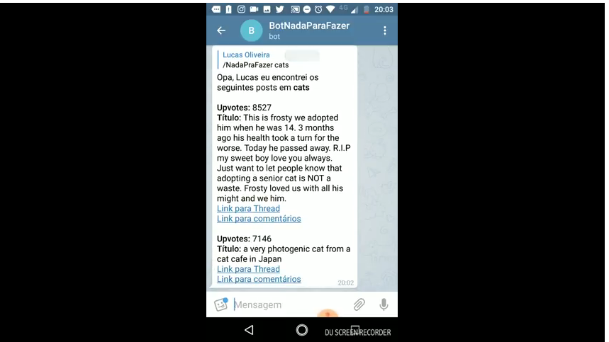

# Desafio IDWall

Lucas Farias de Oliveira

LinkedIN: https://www.linkedin.com/in/luksrn/

O asciicast a seguir é uma apresentação dos resultados do desefio. Há também uma descrição em texto de como executar o projeto, e também alguns resumos da solução.

[](https://asciinema.org/a/WELd0G7Cxmir5jUv6Di4eQkDA)


[](https://www.youtube.com/watch?v=wwNMSc79-F8)

**OBS**: Os videos demonstrativos e toda a documentação é utilizando o Selenium como runner do crawler.
Há uma abstração e implementação que permite utilizar o Jsoup, para exemplificar o impacto de desempenho da utilização
do Selenium vs Jsoup, tenho um exemplo de execução:

**Senelium**

* Início do Cralwer: 22:20:31.428
* Fim do Crawler: 22:21:04.929
* Total: **33 segundos** 

**Jsoup**
* Início do Crawler: 22:15:32.511
* Fim do Crawler: 22:15:38.004
 * Total: **6 segundos**
 
 Pela melhora significativa do Jsoup, o projeto foi alterado para executar por padrão com o Jsoup como _runner_. 
 Para executar com o Selenium, deve-se utilizar o profile _selenium_.

## Estrutura do projeto

O projeto foi estruturado como módulos Maven sendo eles:

* **string-formatter** - Projeto do formatador de Strings.
* **crawler-reddit** - Projeto base do crawler Reddit, que é exportado para utilização na exibição em console e utilização no telegram.
* **crawler-reddit-console** - Projeto de apresentação do Crawler em console, que utiliza o crawler-reddit.
* **crawler-reddit-telegram** - Projeto do Bot Telegram, que utiliza o crawler-redit.

Os passos para obter o projeto em execução são os seguintes:

```
$ git clone https://github.com/luksrn/desafios desafios_luksrn
$ cd desafios_luksrn
$ ls
crawler-reddit  crawler-reddit-console  crawler-reddit-telegram  mvnw  mvnw.cmd  pom.xml  README.md  string-formatter
$ ./mvnw clean package
```
Após executar _./mvnw clean package_ todos os artefatos serão compilados, testados e enpacotados para distribuição.


## Desafio String Formatter

Após construir o projeto, a execução do primeiro desafio, o formatador de Strings, pode ser visualizado pela execução do seguinte comando:

```
$ java -jar string-formatter/target/StringFormatter-1.0-SNAPSHOT.jar 
Inputs: 
Text: In the beginning God created the heavens and the earth. Now the earth was formless and empty, darkness was over the surface of the deep, and the Spirit of God was hovering over the waters.

And God said, "Let there be light," and there was light. God saw that the light was good, and he separated the light from the darkness. God called the light "day," and the darkness he called "night." And there was evening, and there was morning - the first day.
Limit: 40
Should justify: true
=========================
Output: 
In the beginning God created the heavens
and    the  earth.  Now  the  earth  was
formless  and  empty,  darkness was over
the  surface of the deep, and the Spirit
of  God  was  hovering  over the waters.

And  God said, "Let there be light," and
there  was light. God saw that the light
was  good,  and  he  separated the light
from  the darkness. God called the light
"day,"    and  the  darkness  he  called
"night."  And  there  was  evening,  and
there  was  morning  -  the  first  day.

```
O resultado apresentado é o proposto pelo próprio exemplo. Outras saídas são apresentadas neste 
[arquivo](outputs_string_formatter.md).

## Desafio Crawler

### Parte 1 - Versão do Console

Para executar o crawler na versão console você precisa ter uma instância selenium executando por padrão na porta _http://localhost:4444/wd/hub_. Caso seja necessário executar em outra instância, basta informar ao _crawler-reddit-console.jar_ o parâmetro por meio do argument **--selenium.url**. Para isso, você pode executar os seguintes comandos:


```
$ docker run -d -p 4444:4444 --shm-size 2g selenium/standalone-firefox:3.12.0-boron
$ ./mvnw package
$ java -jar crawler-reddit-console/target/crawler-reddit-console.jar --crawler.reddit.subreddits=cats --crawler.reddit.upvotes=1000
```
Neste exemplo, temos os seguintes parâmetros informados:

* **--crawler.reddit.upvotes=1000**  Define qual será o valor de upvotes utilizados para filtrar as threads dos subreddits informados em _crawler.reddit.subreddits_. O valor padrão é 5000
* **--crawler.reddit.subreddits=cats** Define quais serão os subreddits pesquisados pelo crawler. O valor padrão é cats;worldnews;askreddit

A saída desse programa é apresentada no console, por exemplo:

```
$ java -jar crawler-reddit-console/target/crawler-reddit-console.jar --crawler.reddit.subreddits='cats;askreddit' --crawler.reddit.upvotes=2000

  .   ____          _            __ _ _
 /\\ / ___'_ __ _ _(_)_ __  __ _ \ \ \ \
( ( )\___ | '_ | '_| | '_ \/ _` | \ \ \ \
 \\/  ___)| |_)| | | | | || (_| |  ) ) ) )
  '  |____| .__|_| |_|_| |_\__, | / / / /
 =========|_|==============|___/=/_/_/_/
 :: Spring Boot ::        (v2.0.3.RELEASE)

2018-06-16 14:04:53.225  INFO 26378 --- [           main] c.i.c.CrawlerConsoleApplication          : Starting CrawlerConsoleApplication v0.0.1-SNAPSHOT on vostro with PID 26378 (/home/lucas/github/desafios/crawler-reddit-console/target/crawler-reddit-console.jar started by lucas in /home/lucas/github/desafios)
2018-06-16 14:04:53.232  INFO 26378 --- [           main] c.i.c.CrawlerConsoleApplication          : No active profile set, falling back to default profiles: default
2018-06-16 14:04:53.381  INFO 26378 --- [           main] s.c.a.AnnotationConfigApplicationContext : Refreshing org.springframework.context.annotation.AnnotationConfigApplicationContext@63e31ee: startup date [Sat Jun 16 14:04:53 BRT 2018]; root of context hierarchy
2018-06-16 14:04:54.378  INFO 26378 --- [           main] org.openqa.selenium.Capabilities         : Using `new FirefoxOptions()` is preferred to `DesiredCapabilities.firefox()`
2018-06-16 14:04:54.852  INFO 26378 --- [           main] o.s.j.e.a.AnnotationMBeanExporter        : Registering beans for JMX exposure on startup
2018-06-16 14:04:54.904  INFO 26378 --- [           main] c.i.c.CrawlerConsoleApplication          : Started CrawlerConsoleApplication in 2.726 seconds (JVM running for 3.318)
2018-06-16 14:04:54.908  INFO 26378 --- [           main] c.i.c.CrawlerConsoleApplication          : Iniciando subreddits crawller...
2018-06-16 14:04:54.909  INFO 26378 --- [           main] c.i.c.CrawlerConsoleApplication          : 	 * Upvotes = 2000
2018-06-16 14:04:54.910  INFO 26378 --- [           main] c.i.c.CrawlerConsoleApplication          : 	 * SubReddits = cats;askreddit
2018-06-16 14:05:00.102  INFO 26378 --- [ null to remote] o.o.selenium.remote.ProtocolHandshake    : Detected dialect: W3C
2018-06-16 14:05:00.824  INFO 26378 --- [ null to remote] o.o.selenium.remote.ProtocolHandshake    : Detected dialect: W3C
2018-06-16 14:05:00.932  INFO 26378 --- [ null to remote] o.o.selenium.remote.ProtocolHandshake    : Detected dialect: W3C
SubReddit = askreddit
Upvotes = 6710
Título da thread = What is your favorite quote from a Pixar Movie?
Link da Thread = https://old.reddit.com/r/AskReddit/comments/8rcm47/what_is_your_favorite_quote_from_a_pixar_movie/
Link para os comentários = https://old.reddit.com/r/AskReddit/comments/8rcm47/what_is_your_favorite_quote_from_a_pixar_movie/

Upvotes = 6765
Título da thread = Redditors who have no skills whatsoever, what do you do for living or how do you survive?
Link da Thread = https://old.reddit.com/r/AskReddit/comments/8rfwzl/redditors_who_have_no_skills_whatsoever_what_do/
Link para os comentários = https://old.reddit.com/r/AskReddit/comments/8rfwzl/redditors_who_have_no_skills_whatsoever_what_do/

Upvotes = 5126
Título da thread = Students of Reddit, what's the story of the worst teacher you've ever had?
Link da Thread = https://old.reddit.com/r/AskReddit/comments/8rf9ia/students_of_reddit_whats_the_story_of_the_worst/
Link para os comentários = https://old.reddit.com/r/AskReddit/comments/8rf9ia/students_of_reddit_whats_the_story_of_the_worst/

-----------------------------------
SubReddit = cats
Upvotes = 13823
Título da thread = This little idiot learned how to open my freezer and kept stealing frozen chicken breasts and tater tots. I just bought a childproof lock for it and I've never seen him look so upset.
Link da Thread = https://old.reddit.com/r/cats/comments/8re4ui/this_little_idiot_learned_how_to_open_my_freezer/
Link para os comentários = https://old.reddit.com/r/cats/comments/8re4ui/this_little_idiot_learned_how_to_open_my_freezer/

Upvotes = 2279
Título da thread = Sully enjoys being held like a baby when I get home from work
Link da Thread = https://old.reddit.com/r/cats/comments/8rczfy/sully_enjoys_being_held_like_a_baby_when_i_get/
Link para os comentários = https://old.reddit.com/r/cats/comments/8rczfy/sully_enjoys_being_held_like_a_baby_when_i_get/

Upvotes = 3155
Título da thread = Since you guys liked our first pic so much I thought I’d share another: feat. Extra toe beans
Link da Thread = https://old.reddit.com/r/cats/comments/8rj9u0/since_you_guys_liked_our_first_pic_so_much_i/
Link para os comentários = https://old.reddit.com/r/cats/comments/8rj9u0/since_you_guys_liked_our_first_pic_so_much_i/

2018-06-16 14:05:29.296  INFO 26378 --- [       Thread-2] s.c.a.AnnotationConfigApplicationContext : Closing org.springframework.context.annotation.AnnotationConfigApplicationContext@63e31ee: startup date [Sat Jun 16 14:04:53 BRT 2018]; root of context hierarchy
```

### Parte 2 - Versão do Telegram

A versão do Telegram é disponibilizada no Docker por meio do docker-compose. Para executar esta versão do projeto, é necessário informar o Token do BOT fornecido pelo BotFather.


```
$ docker-compose config
WARNING: The TELEGRAM_TOKEN variable is not set. Defaulting to a blank string.
networks:
  idwall-local:
    driver: bridge
services:
  crawler_reddit_telegram:
    build:
      args:
        JAR_FILE: ./target/crawler-reddit-telegram.jar
        TELEGRAM_TOKEN: ''
      context: /home/lucas/github/desafios/crawler-reddit-telegram
      dockerfile: ./crawler-reddit-telegram.dockerfile
    container_name: crawler-reddit-telegram
    depends_on:
    - selenium-firefox
    image: luksrn/crawler-reddit-telegram
    networks:
      idwall-local: null
  selenium-firefox:
    container_name: firefox
    image: selenium/standalone-firefox:3.12.0-boron
    networks:
      idwall-local: null
    volumes:
    - /dev/shm:/dev/shm:rw
version: '3.0'

```

Como informado pelo comando docker-compose config, temos de informar a variável **TELEGRAM_TOKEN**. Para isso, podemos exportar a variável diretamente no shell antes de construir os containers


```
$ export TELEGRAM_TOKEN=598035456:AAGL8betq9tRghcm-5kIxho0CScrQrTIafQ
```


Para verificar que deu certo, ao consultar nosso docker-compose config, devemos visualizar TOKEN preenchido no args:

```
$ docker-compose config
networks:
  idwall-local:
    driver: bridge
services:
  crawler_reddit_telegram:
    build:
      args:
        JAR_FILE: ./target/crawler-reddit-telegram.jar
        TELEGRAM_TOKEN: 598035456:AAGL8betq9tRghcm-5kIxho0CScrQrTIafQ
      context: /home/lucas/github/desafios/crawler-reddit-telegram
      dockerfile: ./crawler-reddit-telegram.dockerfile
    container_name: crawler-reddit-telegram
    depends_on:
    - selenium-firefox
    image: luksrn/crawler-reddit-telegram
    networks:
      idwall-local: null
  selenium-firefox:
    container_name: firefox
    image: selenium/standalone-firefox:3.12.0-boron
    networks:
      idwall-local: null
    volumes:
    - /dev/shm:/dev/shm:rw
version: '3.0'

```

Pronto! Agora só é preciso construir os containers e iniciar os mesmos por meio do docker-compose

```
$ docker-compose build
selenium-firefox uses an image, skipping
Building crawler_reddit_telegram
Step 1/8 : FROM frolvlad/alpine-oraclejdk8
 ---> cdbe05376460
Step 2/8 : MAINTAINER Lucas Oliveira
 ---> Using cache
 ---> 550ef00048a6
Step 3/8 : ENV SPRING_PROFILES_ACTIVE docker
 ---> Using cache
 ---> e444985855c7
Step 4/8 : ARG JAR_FILE
 ---> Using cache
 ---> 5d02c0d113a4
Step 5/8 : ARG TELEGRAM_TOKEN
 ---> Using cache
 ---> 7c53f2b7385c
Step 6/8 : ENV telegram.bot.token ${TELEGRAM_TOKEN}
 ---> Using cache
 ---> 4b8cc9e38b12
Step 7/8 : ADD ${JAR_FILE} app.jar
 ---> Using cache
 ---> 08da5f5522ef
Step 8/8 : ENTRYPOINT java -Djava.security.egd=file:/dev/./urandom -jar /app.jar
 ---> Using cache
 ---> 345bf062ee3d
Successfully built 345bf062ee3d


$ docker-compose up

Creating firefox ... 
Creating firefox ... done
Creating crawler-reddit-telegram ... 
Creating crawler-reddit-telegram ... done
Attaching to firefox, crawler-reddit-telegram
firefox                    | 22:56:26.208 INFO [GridLauncherV3.launch] - Selenium build info: version: '3.12.0', revision: '7c6e0b3'
firefox                    | 22:56:26.209 INFO [GridLauncherV3$1.launch] - Launching a standalone Selenium Server on port 4444
firefox                    | 2018-06-17 22:56:26.290:INFO::main: Logging initialized @350ms to org.seleniumhq.jetty9.util.log.StdErrLog
firefox                    | 22:56:26.507 INFO [SeleniumServer.boot] - Selenium Server is up and running on port 4444
crawler-reddit-telegram    | 
crawler-reddit-telegram    |   .   ____          _            __ _ _
crawler-reddit-telegram    |  /\\ / ___'_ __ _ _(_)_ __  __ _ \ \ \ \
crawler-reddit-telegram    | ( ( )\___ | '_ | '_| | '_ \/ _` | \ \ \ \
crawler-reddit-telegram    |  \\/  ___)| |_)| | | | | || (_| |  ) ) ) )
crawler-reddit-telegram    |   '  |____| .__|_| |_|_| |_\__, | / / / /
crawler-reddit-telegram    |  =========|_|==============|___/=/_/_/_/
crawler-reddit-telegram    |  :: Spring Boot ::        (v2.0.2.RELEASE)
crawler-reddit-telegram    | 
crawler-reddit-telegram    | 2018-06-17 22:56:27.447  INFO 1 --- [           main] co.idwall.crawler.Application            : Starting Application v0.0.1-SNAPSHOT on 91436689cb1e with PID 1 (/app.jar started by root in /)
crawler-reddit-telegram    | 2018-06-17 22:56:27.450  INFO 1 --- [           main] co.idwall.crawler.Application            : The following profiles are active: docker
crawler-reddit-telegram    | 2018-06-17 22:56:27.533  INFO 1 --- [           main] s.c.a.AnnotationConfigApplicationContext : Refreshing org.springframework.context.annotation.AnnotationConfigApplicationContext@1c53fd30: startup date [Sun Jun 17 22:56:27 GMT 2018]; root of context hierarchy
crawler-reddit-telegram    | 2018-06-17 22:56:28.094  INFO 1 --- [           main] f.a.AutowiredAnnotationBeanPostProcessor : JSR-330 'javax.inject.Inject' annotation found and supported for autowiring
crawler-reddit-telegram    | 2018-06-17 22:56:28.181  INFO 1 --- [           main] org.openqa.selenium.Capabilities         : Using `new FirefoxOptions()` is preferred to `DesiredCapabilities.firefox()`
crawler-reddit-telegram    | 2018-06-17 22:56:31.231  INFO 1 --- [           main] o.s.j.e.a.AnnotationMBeanExporter        : Registering beans for JMX exposure on startup
crawler-reddit-telegram    | 2018-06-17 22:56:31.251  INFO 1 --- [           main] co.idwall.crawler.Application            : Started Application in 4.487 seconds (JVM running for 4.977)

```

Neste momento já é possível comunicar-se com o BOT por meio do Telegram!


## Resumão da Solução Implementada


### Formatador de Strings

O IdwallStringFormatter foi ajustado para receber um limite de caracteres e uma implementação de LineFormatter, responsável por conduzir o processo de formatação do texto. Sendo assim, chamadas ao IdwallStringFormatter#format irá utilizar estes argumentos para formatar a String.

```java
LineFormatter formatter = justify ? new JustifyLineFormatter() : new BasicLineFormatter();
        
final IdwallStringFormatter sf = new IdwallStringFormatter(limit, formatter);
String outputText = sf.format(text);
```

A ideia do algoritmo é representar o texto como sendo um conjunto de linhas, que contém palavras que serão apresentadas entre espaços de acordo com a formatação escolhida. Por ser um projeto mais simples, não vou entrar em muitos detalhes, porém é interessante observar as abstrações criadas para manipular a String. :)


### Crawlers

O projeto do crawler é dividido em três projetos, o primeiro **crawler-reddit** é responsável por mapear as páginas do Reddit utilizando o Selenium e o padrão **Page Object** descrito na própria documentação do Selenium (https://www.seleniumhq.org/docs/06_test_design_considerations.jsp#page-object-design-pattern). Este projeto é encapsulado em um .jar e utilizado no **crawler-reddit-console** e o **crawler-reddit-telegram**.


```xml
<dependency>
	<groupId>co.idwall</groupId>
	<artifactId>crawller-reddit</artifactId>
	<version>0.0.1-SNAPSHOT</version>
</dependency>
```

A página do Reddit foi representada, assim como seus elementos individuais (topo).

```java
public class SubRedditPage extends Page {

	private String subReddit;
	
	public SubRedditPage(WebDriver webDriver, String subReddit) {
		super(webDriver, "https://old.reddit.com/r/" + subReddit);
		this.subReddit = subReddit;
	}
	
	public HeaderSubRedditPageElement header() {
		return findByCssSelector("#header")
				.map(HeaderSubRedditPageElement::new)
				.get();
	}
	
	public List<PostPageElement> findPosts(){
		return findAllByCssSelector("div[data-subreddit]")
				.stream()				
				.map(PostPageElement::new)
				.collect(Collectors.toList());
	}
	
	public List<PostPageElement> findPostsAtCurrentPageBy(Predicate<PostPageElement> test){
		return findPosts().stream().filter(test).collect(Collectors.toList());
	}
	
	public void nextPage() {
		findByCssSelector(".next-button a").ifPresent(WebElement::click);
	}
	
	public String getSubReddit() {
		return subReddit;
	}
}
```


As páginas e seus elementos (ex.: HeaderSubRedditPageElement e PostPageElement) são utilizadas pelos crawlers que buscam informações. O projeto contém a definição da busca por tópicos com upvotes como o seguinte:

```java
public class SubRedditPageCrawler {
	
	private SubRedditPage subRedditPage;
	
	public SubRedditPageCrawler(SubRedditPage page) {
		this.subRedditPage = page;
	}

	public SubRedditPostSearchResult findSubRedditTopicsBy(Long upvote) {
		
		subRedditPage.go();
		
		subRedditPage.header().clickTop();
		
		List<SubRedditPost> posts = new ArrayList<>();
		int delta = posts.size();
		do {
			subRedditPage.findPostsAtCurrentPageBy( pe -> pe.getUpvotes() >= upvote && !pe.isPromoted() )
				.stream()
				.map(PostPageElement::toPost)
				.collect(Collectors.toCollection(() -> posts));
			
			if(delta == posts.size() ) {
				break;
			} else {
				delta = posts.size();
				subRedditPage.nextPage();
			}
		} while (true);
		
		return new SubRedditPostSearchResult(subRedditPage.getSubReddit(), posts);
	}
}
```

Basicamente, a ideia é realizar a navegação até o subreddit, em seguida clicar na ordenação por "top" e começa a procurar nas páginas os posts relevantes, parando quando não encontra resultados em uma página. Os objetos retornados são POJOs contendo as informações necessárias ao projeto. A utilização das classes do módulo **crawler-reddit** no projeto **crawler-reddit-telegram** é exemplificado a seguir:

```java
package co.idwall.crawler.telegram.bots.handlers;
...
import co.idwall.crawler.reddit.SubRedditPostSearchResult;
import co.idwall.crawler.reddit.crawlers.SubRedditPageCrawler;
import co.idwall.crawler.reddit.pages.SubRedditPage;
import co.idwall.crawler.selenium.WebDriverProvider;

@Component
public class NadaPraFazerSubRedditFetcher {
	
	@Value("${crawler.subreddit.upvote}")
	private Long upvote;
	
	@Autowired
	private WebDriverProvider webDriverProvider;
	
	public void search(String subRedditsByComma, Consumer<SubRedditPostSearchResult> consumerSubRedditResult ) {
	    Arrays.asList(subRedditsByComma.split(";"))
				.parallelStream()
	        	.map( subReddit -> new SubRedditPage(webDriverProvider.get(), subReddit) )
	        	.map(SubRedditPageCrawler::new)
	        	.map( crawler -> crawler.findSubRedditTopicsBy(upvote) )
	        	.forEach(consumerSubRedditResult::accept);
	}
}
```

Neste código é importante perceber a criação do objeto _SubRedditPage_, que utiliza o WebDriver do Selenium - abstraído pelo _WebDriverProvider_ - e o subreddit em questão. Esta instância de página é utilizada por um Crawler, chamado _SubReedditPageCrawler_ que possui métodos de navegação na página para obtenção de informações, sendo _SubReedditPageCrawler#findSubRedditTopicsBy_ um exemplo, expondo o resultado do processamento para um consumer informado pelo usuário. Um exemplo do uso é o seguinte:

```java
subRedditFetcher.search(subRedditsByComma, (subRedditPostSearchResult) -> {
		String replyMessage = convertToMessage(subRedditPostSearchResult, originalMessage);
   		replyToUser(replyMessage,originalMessage);
});
```

Para maiores detalhes, por favor, observar estruturação de todas as classes e código nos projetos em questão. :)

#### OBS 1

Durante o trabalho tentei utilizar um starter do bot telegram, porém havia alguns problemas na release atual. Um PR foi feito no projeto, embora ainda não tive resposta :~

https://github.com/rubenlagus/TelegramBots/pull/477

#### OBS 2

Imagino que poderia haver algumas otimizações no processo de comunicação com o Selenium, o handshake para estabelecer a sessão com o firefox utilizando o RemoteWebDriver é bem lento. Porém, não tive oportunidade de investigar com mais calma.
